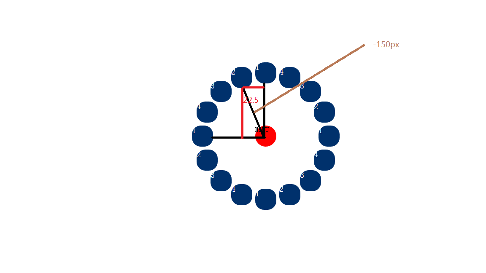

#css扇形/圆形导航

###HTML结构
```
<div id="menu">
			<ul id="menu_list">
				<li>1</li>
				<li>2</li>
				<li>3</li>
				<li>4</li>
				<li>1</li>
				<li>2</li>
				<li>3</li>
				<li>4</li>
				<li>1</li>
				<li>2</li>
				<li>3</li>
				<li>4</li>
				<li>1</li>
				<li>2</li>
				<li>3</li>
				<li>4</li>
			</ul>
			<div id="menu_button">
			MENU
			</div>
		</div>
```
首先我们要做一个圆,圆是360°,那么我们可以分割成4个90°,每个90°放4个li,也就是360°16个li

###CSS
```
	<style type="text/css">
			body,html{
				width: 100%;
				height: 100%;
				overflow: hidden;
			}
			*{margin: 0; padding: 0;}
			ul{list-style: none;}
			#menu_list{
				position: relative;
			}
			#menu_list li{
				background: #00316C;
				width: 50px;
				height: 50px;
				color: white;
				font-size: 20px;
				border-radius: 21px;
/*				所有li都叠在一起,通过js把他们分离出去,然后在这些li上再放一个按钮也就是menu_button 起遮挡作用*/
				position: absolute;
				left: 0;
				top: 0;
				-webkit-transition: 0.5s all ease;
				display: inline-block;
			}
			#menu{
				position: fixed;
				right: 200px;
				bottom: 200px;
				border-radius:50% 50%;
				width: 50px;
				height: 50px;
			}
			#menu_button{
				width: 50px;
				height: 50px;
				background: red;
				position: absolute;
				left: 0;
				top: 0;
				transition: 1s;
				border-radius: 50% 50%;
				cursor: default;
			}
```

###JS

每个角度都是22.5° 16个li就是360°
然后我们求出li的left和top就okay了~
```
window.onload=function(){
				var oButton=document.getElementById("menu_button");
				var oList=document.getElementById("menu_list").getElementsByTagName("li")
				var boff=true;
				var iR=-150;
				oButton.onclick=function(){
					if(boff){
						//点击旋转menu按钮
						this.style.WebkitTransform="rotate(-360deg)"
						//分离li
						for(var i=0;i<oList.length;i++){
							var oLt=toLT(iR,22.5*i)
							//延迟出现
							oList[i].style.transition="0.5s "+i*100+"ms"
							oList[i].style.left=oLt.l+"px";
							oList[i].style.top=oLt.t+"px";
							oList[i].style.WebkitTransform="rotate(-720deg)"
						}
					}else{
						//点击旋转menu按钮至原位
						this.style.WebkitTransform="rotate(0deg)"
						//点击收回li
						for(var i=0;i<oList.length;i++){
							//延迟收回从最后一个开始收回而不是第一个
							oList[i].style.transition="0.5s "+(oList.length-i-1)*100+"ms"
							oList[i].style.left=0+"px";
							oList[i].style.top=0+"px";
							oList[i].style.WebkitTransform="rotate(0deg)"
						}
					}
					boff=!boff
				}
				
				function toLT(iR,iDeg){
					return{
						//根据图片理解就okay了~ iR是半径
						l:Math.round(Math.sin(iDeg/180*Math.PI)*iR),
						t:Math.round(Math.cos(iDeg/180*Math.PI)*iR)
					}
				}
			}
```


